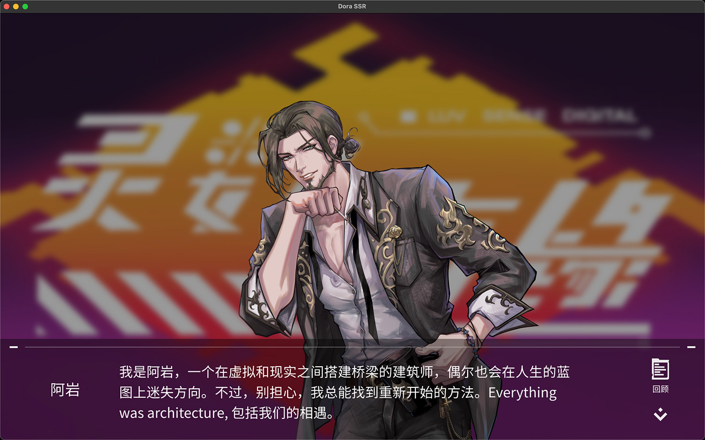

# Dora Story Engine



The Dora Story Engine is a visual novel game framework developed based on Dora SSR. This framework integrates the Yarn Spinner dialogue system and uses the open-source game "灵数奇缘" (Luv Sense Digital) code and authorized art assets, providing a complete solution for visual novel game development.

## Getting Started

1. **Install Dora SSR Engine**

	Download the latest release from [here](https://github.com/ippclub/Dora-SSR/releases/latest). Refer to the [documentation](https://dora-ssr.net/docs/tutorial/quick-start/) to complete the installation and setup of the game engine.

2. **Obtain Project Files**

	Clone or download the project files. In Dora SSR’s Web IDE, use the resource manager on the left to upload the project folder or zip archive and import it into the Dora SSR engine. If uploading a Zip archive, make sure to extract it.

3. **Launch the Game**

	In Dora SSR’s Web IDE, click the “Launch Game” button in the bottom-right corner to start the game.

## Added Yarn Spinner Commands

This project adds the following commands to the Yarn Spinner dialogue system, which is based on the original Dora SSR. Yarn Spinner is a simple dialogue scripting language, and you can quickly get started with this [tutorial](https://dora-ssr.net/docs/tutorial/Writing%20Game%20Dialogue/introduction-to-yarn).

* **Player Name Input Box**

	```
	<<inputName>>
	```

	This command prompts the player to input their name, which is stored in the variable `$charName`.

* **Background Image**

	```
	<<background "Image/bg_001.png", true>>
	```

	Sets the background image. The first parameter is the path to the background image, and the second parameter determines if the image should be blurred.

* **Character Portrait**

	```
	<<figure "Image/ch_001.png", 0, 200, 1.5>>
	```

	Sets the character portrait. The first parameter is the image path, the second is the X-axis offset, the third is the Y-axis offset, and the fourth is the scale of the portrait.

* **Background Music**

	```
	<<BGM "Music/军事学园.mp3">>
	```

	Sets the background music. The first parameter is the path to the music file.

* **Stop Background Music**

	```
	<<stopBGM>>
	```

	Stops the background music.

* **Play Sound Effect**

	```
	<<SE "Sound/door_knock.wav">>
	```

	Plays the sound effect. The first parameter is the path to the sound effect file.

* **Start Next Chapter**

	```
	<<chapter "tutorial.yarn">>
	```

	Starts the next chapter. The first parameter is the path to the chapter file. The current chapter will stop automatically, and the progress will be saved so the game can continue from the same point the next time it’s launched.

* **Preload Resources**

	```
	<<preload "Image/bg_001.png">>
	<<preload "moling">>
	```

	Preloads resources asynchronously before the next dialogue line is displayed, reducing lag during interactions. The first parameter can be a resource path or a Spine character asset name. Available character names include:

	- char
	- charF
	- charM
	- ninilite
	- ayan
	- villywan
	- moling
	- moyu
	- liyena
	- sunborn
	- wuyun
	- vika
	- vivi
	- yuzijiang

* **Using Project’s Spine Characters**

	```
	[char id=moling name=默翎] Midnight is my stage, the lab is more suitable than a bed—if there’s something, just say it directly, no need to beat around the bush.
	```

	Using the format `[char id=moling name=默翎]`, where `id=` refers to the project’s built-in Spine character resource name (e.g., `moling`), and `name=` allows you to assign a name to the character. This displays the assigned character name along with the Spine portrait.

## Using Automatically Stored Yarn Spinner Variables

The framework automatically stores Yarn Spinner variables and will read them the next time the game is launched. To use these variables, add them to the `Script/Data/Config.tl` file. Locate and modify the following code:

```lua
local conf = Config(
	"story", -- Database name
	"charName", -- Player name
	"chapter", -- Current chapter
	-- Additional custom variables
	"gold", -- Temporary variable for tutorial dialogue
	"name" -- Temporary variable for tutorial dialogue
)
```

These variables can be used in Yarn Spinner scripts as shown below. The framework automatically stores the variable in the database when it changes:

```
<<set $gold to 100>>
Gold count: {$gold}.
Player name: {$charName}.
```

## Copyright Notice

This project uses the game code and authorized art assets from *Luv Sense Digital*.

## Related Projects

- [Dora SSR Engine](https://github.com/ippclub/Dora-SSR)
- [Luv Sense Digital Assets](https://github.com/ippclub/LSD-spine-2x)
- [YarnFlow](https://github.com/ippclub/YarnFlow) - To use the same Yarn Spinner language on top of any Lua environment, you can try out YarnFlow.

## Open Source License

This project is licensed under the [MIT Open Source License](LICENSE).
